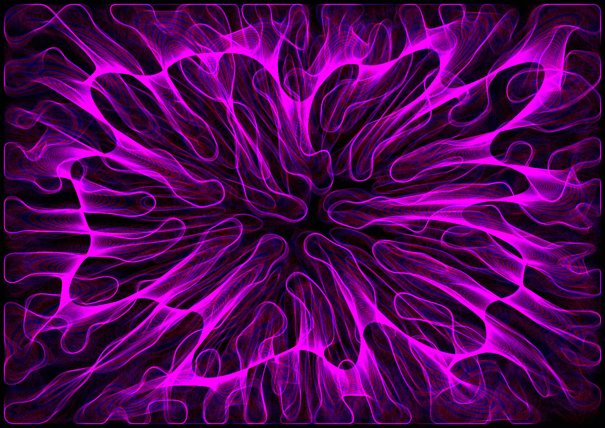

# Dendrite

A differential growth curve expands radially with no boundary — it grows to 
the edges of the canvas, meets them, bounces back. A multi-octave fractal 
field (fBm) modulates each node's repulsion radius locally: the environment 
is uneven at every scale, the curve senses it. The dendrite is the neural 
structure that branches in every direction searching for synaptic connections. 
It doesn't know where they are. It searches. The final form is that search, 
solidified in a bounded space.

**Series**: Latent Series — No. 2 of 3  
**Date**: March 2026  
**Medium**: p5.js, fine art digital print on Canson Platine Fibre Rag 310g, A2  
**Edition**: 5 + 1 AP  
**Code**: built in collaboration with AI as programming partner

[Live sketch](https://PintoFrancesco.github.io/latent/Dendrite/) · [Video](https://vimeo.com/1200017445) · [pinto.codes](https://pinto.codes)
