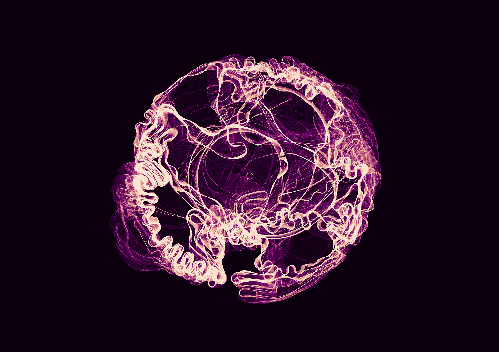

# Morphogen

A closed curve grows under differential growth rules. A Perlin noise field 
modulates the boundary, introducing heterogeneity into the growth environment. 
The mouse click is the morphogen: the signaling molecule that in biology tells 
cells where and how much to grow. Each click introduces a local repulsion. 
The curve responds. What remains is the optical accumulation of every state 
the system passed through as it unfolded. Magenta on black.

**Series**: Latent Series — No. 1 of 3  
**Date**: January 2026  
**Medium**: Processing 4, fine art digital print on Canson Platine Fibre Rag 310g, A2  
**Edition**: 5 + 1 AP  
**Code**: built in collaboration with AI as programming partner

*Requires [Processing 4](https://processing.org/download). Open `filamenti.pde` to run.*

[pinto.codes](https://pinto.codes)

