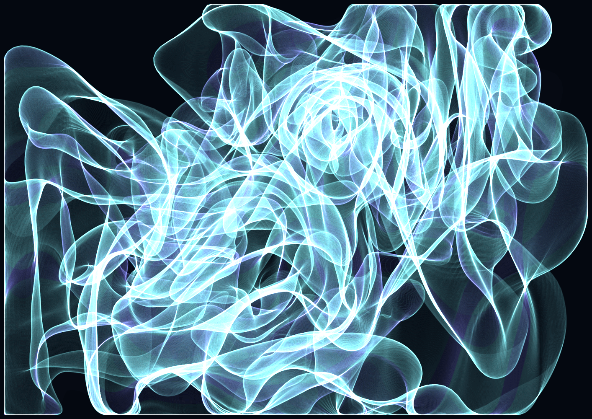

# Phage

Differential growth with curl noise — a divergence-free flow field that 
deflects every node of the growing curve without changing the underlying rules. 
The curl noise is the phage: an external agent that inserts itself into the 
system's logic and bends trajectories toward unexpected paths. The code 
remains identical. The form that emerges is different. Phenotypic mutation: 
the phage introduces the variation but does not determine its outcome.

**Series**: Latent Series — No. 3 of 3  
**Date**: May 2026  
**Medium**: p5.js, fine art digital print on Canson Platine Fibre Rag 310g, A2  
**Edition**: 5 + 1 AP  
**Code**: built in collaboration with AI as programming partner

[Live sketch](https://PintoFrancesco.github.io/phage) · [pinto.codes](https://pinto.codes)

